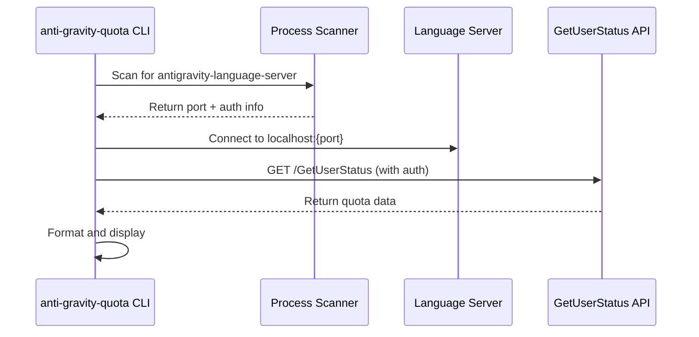

# Antigravity Quota CLI Tool - Implementation Plan

Xây dựng CLI tool nhẹ, nhanh để quản lý và hiển thị quota của các AI models trong Antigravity, hỗ trợ nhiều Google accounts.

## Decisions Made

> [!NOTE]
> **Ngôn ngữ đã chọn**: **Go** ✅
> - Binary nhỏ, nhanh, không cần runtime
> - Cross-platform tốt
> - Stdlib có sẵn process scanning và HTTP client

> [!NOTE]
> **Tên tool**: `anti-gravity-quota` ✅

---

## Proposed Changes

### Core Architecture

```
anti-gravity-quota/
├── cmd/
│   └── anti-gravity-quota/
│       └── main.go          # CLI entry point
├── internal/
│   ├── detector/
│   │   └── process.go       # Detect Antigravity Language Server process
│   ├── client/
│   │   └── quota.go         # GetUserStatus API client  
│   ├── config/
│   │   └── accounts.go      # Multi-account configuration
│   └── display/
│       └── table.go         # Terminal output formatting
├── docs/
│   ├── technical.md         # Tài liệu kỹ thuật
│   ├── user_guide.md        # Hướng dẫn sử dụng
│   └── implementation/      # Planning docs
├── go.mod
├── go.sum
└── README.md
```

---

### Component 1: Process Detector

Scans running processes để tìm Antigravity Language Server, extract connection parameters.

#### [NEW] [process.go](file:///home/gundamkid/.gemini/antigravity/scratch/agq/internal/detector/process.go)

**Logic:**
1. Scan processes tìm `antigravity-language-server` hoặc process có pattern phù hợp
2. Extract port từ command line arguments hoặc listening sockets
3. Extract auth token từ process environment hoặc config files tại `~/.gemini/`

**Linux implementation:**
```go
// Pseudo-code
func DetectAntigravity() (*Connection, error) {
    // 1. Find process via /proc or `ps aux`
    // 2. Get listening port via `netstat` or /proc/{pid}/fd
    // 3. Read auth token from ~/.gemini/oauth_creds.json (or appropriate path)
// ...
    return &Connection{Port: port, Token: token}, nil
}
```

---

### Component 2: Quota API Client

Gọi GetUserStatus API để lấy quota data.

#### [NEW] [quota.go](file:///home/gundamkid/projects/anti-gravity-quota/internal/client/quota.go)

**API Call:**
```go
type QuotaInfo struct {
    Model          string
    Used           int64
    Limit          int64
    ResetTime      time.Time
    PercentageUsed float64
}

func GetUserStatus(conn *Connection) ([]QuotaInfo, error) {
    // HTTP GET/POST to localhost:{port}/GetUserStatus
    // with Authorization header
}
```

**Expected Response (based on research):**
```json
{
  "models": [
    {
      "name": "gemini-3-pro",
      "quotaUsed": 1500,
      "quotaLimit": 5000,
      "resetAt": "2026-01-26T10:00:00Z"
    },
    {
      "name": "claude-4.5",
      "quotaUsed": 200,
      "quotaLimit": 1000,
      "resetAt": "2026-01-26T10:00:00Z"
    }
  ]
}
```

---

### Component 3: Multi-Account Support

Đọc và quản lý multiple Google accounts từ config.

#### [NEW] [accounts.go](file:///home/gundamkid/projects/anti-gravity-quota/internal/config/accounts.go)

**Config Location:**
- Read existing: `~/.gemini/google_accounts.json`
- CLI config: `~/.config/anti-gravity-quota/config.yaml`

```yaml
# ~/.config/anti-gravity-quota/config.yaml
accounts:
  - email: ngoanhtuan245@gmail.com
    active: true
  - email: work@company.com
    active: false

display:
  format: table  # table | json | compact
  refresh: 120   # seconds
```

---

### Component 4: CLI Interface

#### [NEW] [main.go](file:///home/gundamkid/projects/anti-gravity-quota/cmd/anti-gravity-quota/main.go)

**Commands:**
```bash
# Xem quota của account hiện tại
anti-gravity-quota

# Xem quota của tất cả accounts
anti-gravity-quota --all

# Xem quota dạng JSON
anti-gravity-quota --json

# Xem quota compact (1 dòng)
anti-gravity-quota -c

# Liệt kê accounts
anti-gravity-quota accounts list

# Switch account
anti-gravity-quota accounts switch work@company.com

# Watch mode (auto refresh)
anti-gravity-quota --watch
```

**Output Example:**
```
╭─────────────────────────────────────────────────────────────╮
│  Anti-Gravity Quota Monitor                                 │
│  Account: ngoanhtuan245@gmail.com                           │
├─────────────────────────────────────────────────────────────┤
│  MODEL           │  USED/LIMIT    │  REMAINING  │  RESETS   │
├──────────────────┼────────────────┼─────────────┼───────────┤
│  Gemini 3 Pro    │  1,500/5,000   │   70% ████░ │  4h 32m   │
│  Claude 4.5      │    200/1,000   │   80% ████░ │  4h 32m   │
│  GPT-OSS 120B    │      0/2,000   │  100% █████ │  4h 32m   │
╰─────────────────────────────────────────────────────────────╯
```

---

### Component 5: Terminal Display

#### [NEW] [table.go](file:///home/gundamkid/projects/anti-gravity-quota/internal/display/table.go)

Sử dụng library như `charmbracelet/lipgloss` hoặc `olekukonko/tablewriter` cho beautiful terminal output.

---

## Technical Notes

### Quota Fetching Mechanism (từ Research)



### Dependencies

| Package | Purpose |
|---------|---------|
| `spf13/cobra` | CLI framework |
| `charmbracelet/lipgloss` | Terminal styling |
| `shirou/gopsutil` | Cross-platform process detection |
| `gopkg.in/yaml.v3` | Config parsing |

---

## Verification Plan

### Automated Tests

1. **Unit tests** cho process detection
2. **Integration test** gọi actual API (khi có Antigravity running)

```bash
# Run all tests
go test ./...

# Run with coverage
go test -cover ./...
```

### Manual Verification

1. Chạy `anti-gravity-quota` khi Antigravity đang active
2. Verify quota numbers match với Antigravity IDE
3. Test switch account
4. Test trên Linux environment của bạn

---

## Future Enhancements (Nice-to-have)

- [ ] Desktop notification khi quota < 20%
- [ ] Auto-switch account khi hết quota
- [ ] Usage history lưu local
- [ ] TUI mode với realtime charts
