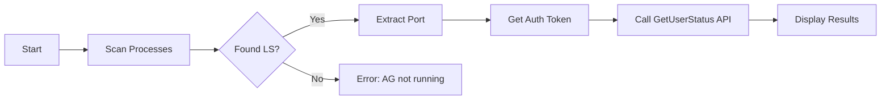

# Tài liệu Kỹ thuật - Anti-Gravity Quota

## Tổng quan Kiến trúc

**Anti-Gravity Quota** là CLI tool được viết bằng Go, thiết kế theo nguyên tắc **đơn giản, nhanh, và modular**.

```
anti-gravity-quota/
├── cmd/
│   └── anti-gravity-quota/
│       └── main.go              # Entry point, CLI commands
├── internal/
│   ├── detector/
│   │   └── process.go           # Process detection
│   ├── client/
│   │   └── quota.go             # API client
│   ├── config/
│   │   └── accounts.go          # Configuration management
│   └── display/
│       └── table.go             # Terminal output
├── docs/
│   ├── technical.md             # Tài liệu này
│   ├── user_guide.md            # Hướng dẫn sử dụng
│   └── implementation/
│       ├── task.md              # Task tracking
│       └── implementation_plan.md
├── go.mod
├── go.sum
└── README.md
```

---

## Cơ chế hoạt động

### 1. Process Detection

**Anti-Gravity Quota** hoạt động bằng cách phát hiện process của Antigravity Language Server đang chạy trên máy.



**Linux Implementation:**
```go
// Scan /proc để tìm process
func findAntigravityProcess() (*ProcessInfo, error) {
    files, _ := os.ReadDir("/proc")
    for _, f := range files {
        if !f.IsDir() {
            continue
        }
        pid := f.Name()
        cmdline, _ := os.ReadFile(fmt.Sprintf("/proc/%s/cmdline", pid))
        if strings.Contains(string(cmdline), "antigravity") {
            return parseProcessInfo(pid)
        }
    }
    return nil, ErrNotFound
}
```

### 2. Port Discovery

Sau khi tìm được process, tool xác định port mà Language Server đang listen:

```go
// Đọc từ /proc/{pid}/fd để tìm listening sockets
func discoverPort(pid string) (int, error) {
    fdPath := fmt.Sprintf("/proc/%s/fd", pid)
    // Scan file descriptors
    // Parse socket info
    // Return listening port
}
```

**Alternative:** Parse command line arguments của process, thường chứa `--port=XXXX`.

### 3. Authentication

Auth token được lấy từ file OAuth credentials:

```go
const (
    OAuthCredsPath = "~/.gemini/oauth_creds.json"
    GoogleAccountsPath = "~/.gemini/google_accounts.json"
)

type OAuthCreds struct {
    AccessToken  string `json:"access_token"`
    RefreshToken string `json:"refresh_token"`
    ExpiresAt    int64  `json:"expires_at"`
}
```

### 4. Quota API

Gọi internal API của Language Server:

```go
func (c *Client) GetUserStatus() (*QuotaResponse, error) {
    url := fmt.Sprintf("http://localhost:%d/GetUserStatus", c.port)
    
    req, _ := http.NewRequest("GET", url, nil)
    req.Header.Set("Authorization", "Bearer " + c.token)
    
    resp, err := c.http.Do(req)
    // Parse response
}
```

**Response Structure:**
```go
type QuotaResponse struct {
    Models []ModelQuota `json:"models"`
}

type ModelQuota struct {
    Name       string    `json:"name"`
    QuotaUsed  int64     `json:"quotaUsed"`
    QuotaLimit int64     `json:"quotaLimit"`
    ResetAt    time.Time `json:"resetAt"`
}
```

---

## Data Models

### Configuration

```go
type Config struct {
    Accounts []Account `yaml:"accounts"`
    Display  Display   `yaml:"display"`
}

type Account struct {
    Email    string `yaml:"email"`
    Active   bool   `yaml:"active"`
}

type Display struct {
    Format  string `yaml:"format"`  // table, json, compact
    Refresh int    `yaml:"refresh"` // seconds
}
```

**Config file location:** `~/.config/anti-gravity-quota/config.yaml`

### Quota Info

```go
type QuotaInfo struct {
    Model          string
    Used           int64
    Limit          int64
    Remaining      int64
    PercentageUsed float64
    ResetTime      time.Time
    TimeUntilReset time.Duration
}

func (q *QuotaInfo) PercentageRemaining() float64 {
    return 100.0 - q.PercentageUsed
}

func (q *QuotaInfo) Status() string {
    switch {
    case q.PercentageRemaining() > 20:
        return "healthy"
    case q.PercentageRemaining() > 0:
        return "low"
    default:
        return "exhausted"
    }
}
```

---

## Dependencies

| Package | Version | Purpose |
|---------|---------|---------|
| `github.com/spf13/cobra` | v1.8+ | CLI framework |
| `github.com/charmbracelet/lipgloss` | v0.9+ | Terminal styling |
| `github.com/shirou/gopsutil/v3` | v3.24+ | Cross-platform process detection |
| `gopkg.in/yaml.v3` | v3.0+ | YAML config parsing |
| `github.com/olekukonko/tablewriter` | v0.0.5 | Table formatting |

---

## Error Handling

```go
var (
    ErrAntigravityNotRunning = errors.New("antigravity language server not found")
    ErrPortNotFound          = errors.New("could not determine language server port")
    ErrAuthFailed            = errors.New("authentication failed")
    ErrQuotaFetchFailed      = errors.New("failed to fetch quota information")
)
```

---

## Performance Considerations

1. **Process scanning**: Cache process info, chỉ rescan khi cần
2. **HTTP client**: Reuse connection, set reasonable timeout (5s)
3. **Binary size**: Sử dụng `-ldflags="-s -w"` để strip debug info (~3-5MB)

```bash
# Build optimized
go build -ldflags="-s -w" -o anti-gravity-quota ./cmd/anti-gravity-quota
```

---

## Testing Strategy

### Unit Tests
```go
func TestProcessDetection(t *testing.T) {
    // Mock /proc filesystem
}

func TestQuotaParser(t *testing.T) {
    // Test JSON parsing
}
```

### Integration Tests
```go
func TestLiveQuotaFetch(t *testing.T) {
    if os.Getenv("ANTIGRAVITY_RUNNING") != "1" {
        t.Skip("Antigravity not running")
    }
    // Test real API call
}
```

---

## Security Notes

- Auth tokens được đọc từ local files, không được log hoặc expose
- Không gửi data ra ngoài, chỉ communicate với localhost
- Config files nên có permission 600

```bash
chmod 600 ~/.config/anti-gravity-quota/config.yaml
```
